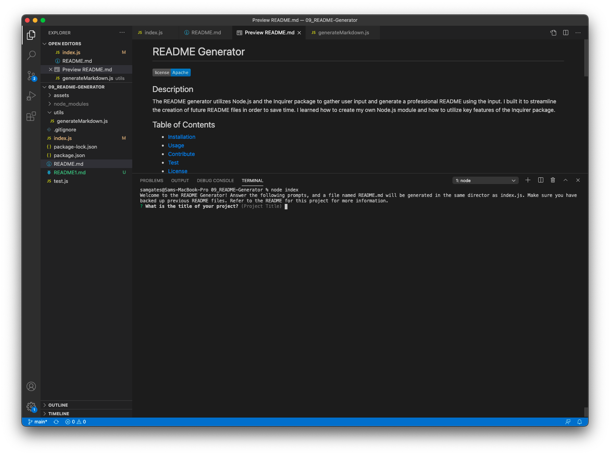
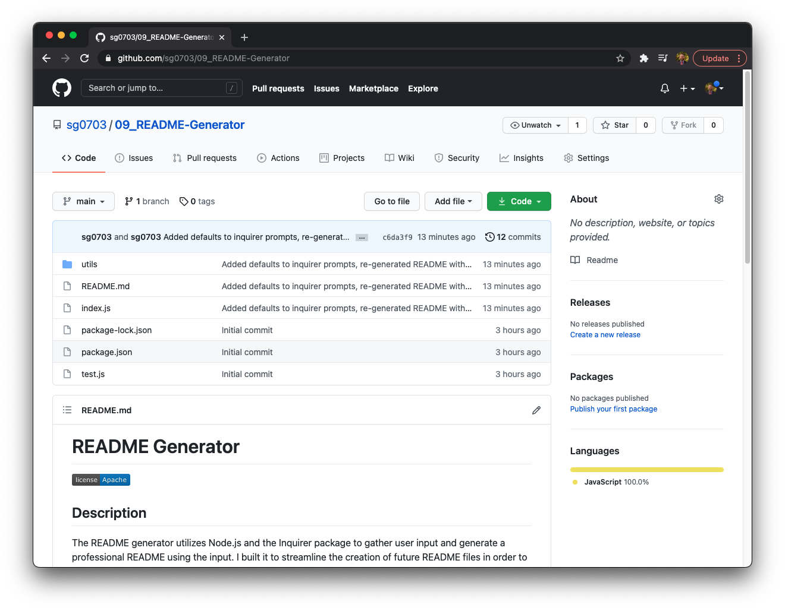

  # Example Project 1

  
  
  ## Description

  This app assists with generating README files for new projects. 

  ## Table of Contents 
  
  - [Installation](#installation)
  - [Usage](#usage)
  - [Contribute](#contribute)
  - [Test](#test)
  - [License](#license)
  - [Questions](#questions)
  
  ## Installation

  Simply clone the GitHub repo or download the source files, Node.js, and Inquirer package. 
  
  ## Usage

  In order to use the app, go to the root directorywhere index.js is located and type node index, then follow the prompts. 
  
  
  
  
  
  ## Contribute

  Anyone is welcome to contribute!
  
  ## Test

  Download the source code and type node index, answer the prompts, and then compare your input with what is in the generated README.md file. 
  
  ## License
  
  
  Copyright (c) Sam Gates. All rights reserved. 
  Licensed under the [Apache](https://www.apache.org/licenses/LICENSE-2.0.txt) license.
  
  ## Questions
  
  Check out my [GitHub Profile](https://github.com/sg0703).
  
  Email with questions! You can reach me at sam.j.gates@gmail.com.
  