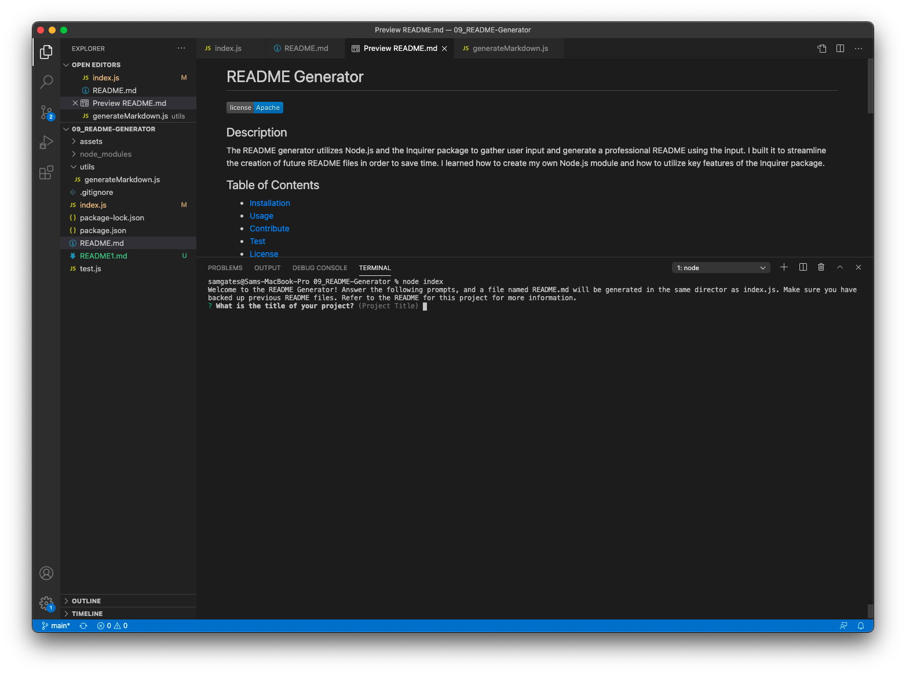
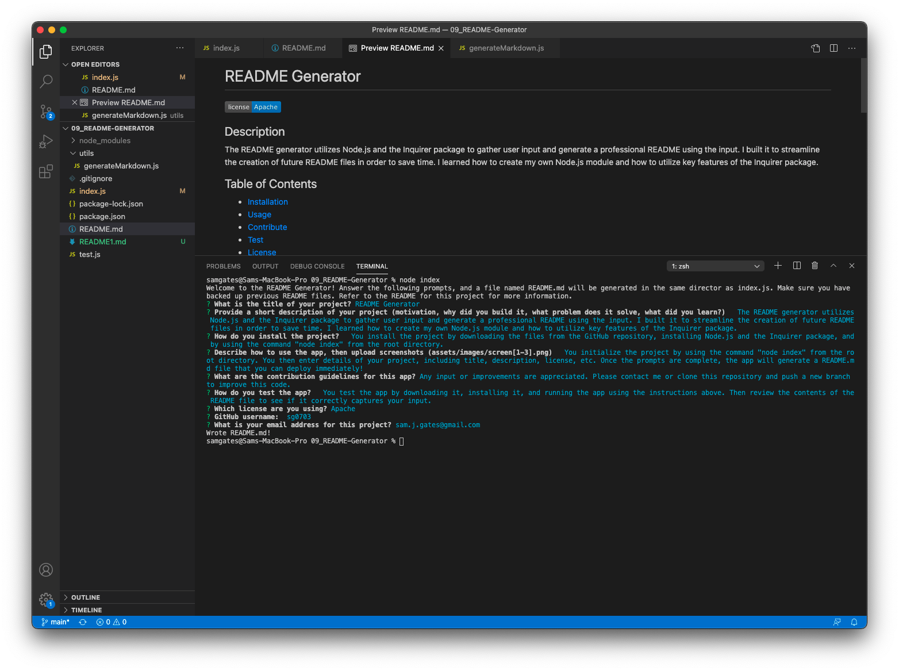
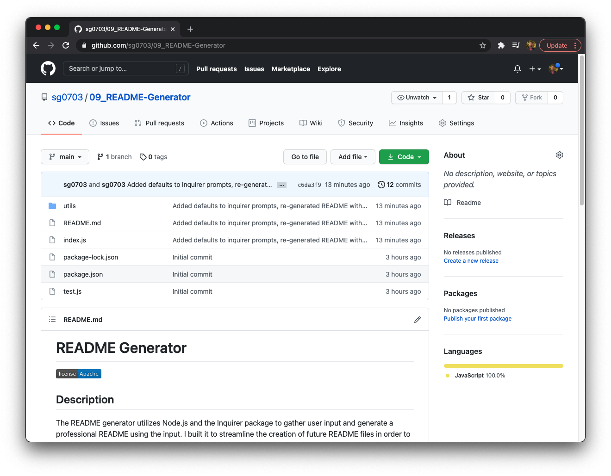

  # README Generator

  
  
  ## Description

  The README generator utilizes Node.js and the Inquirer package to gather user input and generate a professional README using the input. I built it to streamline the creation of future README files in order to save time. I learned how to create my own Node.js module and how to utilize key features of the Inquirer package.

  ## Table of Contents 
  
  - [Installation](#installation)
  - [Usage](#usage)
  - [Contribute](#contribute)
  - [Test](#test)
  - [License](#license)
  - [Questions](#questions)
  
  ## Installation

  You install the project by downloading the files from the GitHub repository, installing Node.js and the Inquirer package, and by using the command "node index" from the root directory.
  
  ## Usage

  You initialize the project by using the command "node index" from the root directory. You then enter details of your project, including title, description, license, etc. Once the prompts are complete, the app will generate a README.md file that you can deploy immediately!
  
  
  
  
  
  ## Contribute

  Any input or improvements are appreciated. Please contact me or clone this repository and push a new branch to improve this code.
  
  ## Test

  You test the app by downloading it, installing it, and running the app using the instructions above. Then review the contents of the README file to see if it correctly captures your input.
  
  ## License
  
  Copyright (c) Sam Gates. All rights reserved. 
  Licensed under the [Apache](https://www.apache.org/licenses/LICENSE-2.0.txt) license.
  
  ## Questions
  
  Check out my [GitHub Profile](https://github.com/sg0703).
  
  Email with questions! You can reach me at sam.j.gates@gmail.com.
  